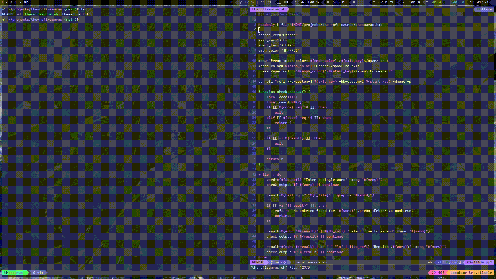

# A simple English thesaurus with the rofi interface



# Usage

Just run the `therofisaurus.sh` script :smile: I put it inside my `rc.lua` and mapped it to
<kbd>Alt</kbd> + <kbd>t</kbd>.

:warning: If <kbd>Alt</kbd> + <kbd>q</kbd> or <kbd>Alt</kbd> + <kbd>a</kbd> mapping
is already in use in rofi you will need to replace it inside the script with something isn't used. :warning:

For example,

```bash
exit_key="Alt+i"
start_key="Alt+s"
```

provided those aren't used by rofi. Actually, <kbd>Esc</kbd> should be sufficient for exit :smile:
